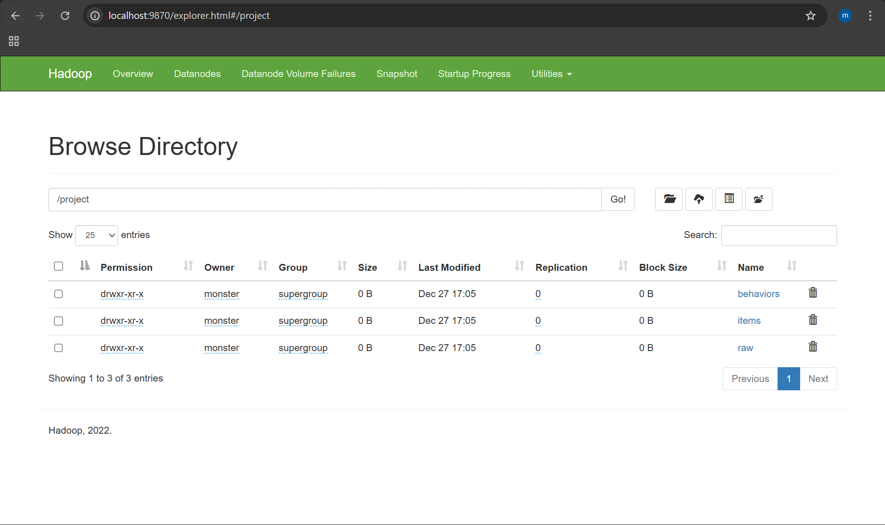
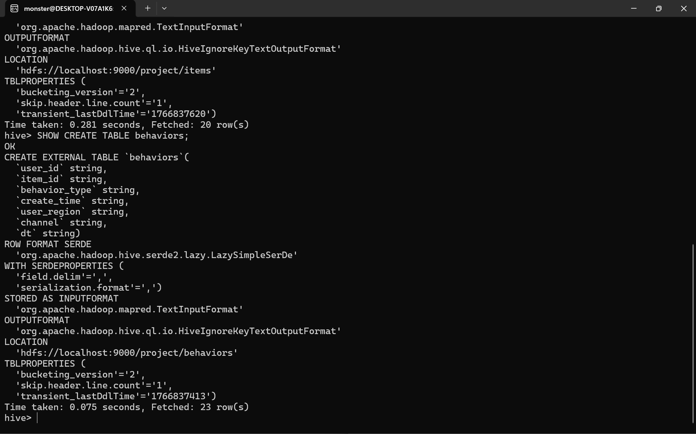

# E-Commerce User Behavior Analysis Pipeline
> **Big Data Project: Conversion Funnel & Promotional Effect Optimization**

## 🏛️ Data Engineering & Warehousing

### 1. Environment & Cluster Status
The project runs on a pseudo-distributed Hadoop cluster. Services are monitored via the HDFS Web UI and JPS command to ensure data node health.

*Monitoring the Hadoop cluster via the Web Interface (Port 9870)*

### 2. Distributed Storage (HDFS)
Raw data (`d3.csv` and `d5.csv`) is partitioned into HDFS directories to facilitate parallel processing.

*Visualizing the file hierarchy within HDFS*

### 3. Hive Schema & ETL
I implemented **External Tables** to decouple data storage from the Hive metastore. This ensures data persistence even if tables are dropped.

*Defining the schema for e-commerce behavior logs*

---

## 📊 Business Insights & Visualizations

Using Python's Seaborn and Matplotlib libraries, I transformed processed Hive data into actionable charts.

### Conversion Funnel Analysis
This chart identifies the "drop-off" points in the customer journey. The analysis shows a significant bottleneck at the **Add-to-Cart** stage.

### Category Distribution
Understanding which product segments drive the most engagement.

### Analytical Logic (Python)
The backend processing utilizes a dedicated virtual environment to manage dependencies and execute visualization scripts.

*Snippet of the visualization logic and environment setup*

---

## 🔧 Troubleshooting & Problem Solving
* **WSL2 Configuration:** Resolved hostname parsing errors by binding Hadoop services to `localhost`.
* **Hive Optimization:** Used `EXPLAIN` plans to verify query execution paths for join operations (as seen in image 9).

---

## 🚀 Optimization Recommendations
* **Strategy:** Implementing small-value incentives (coupons) and optimizing the add-to-cart guidance button is expected to increase final conversion by ~15%.
